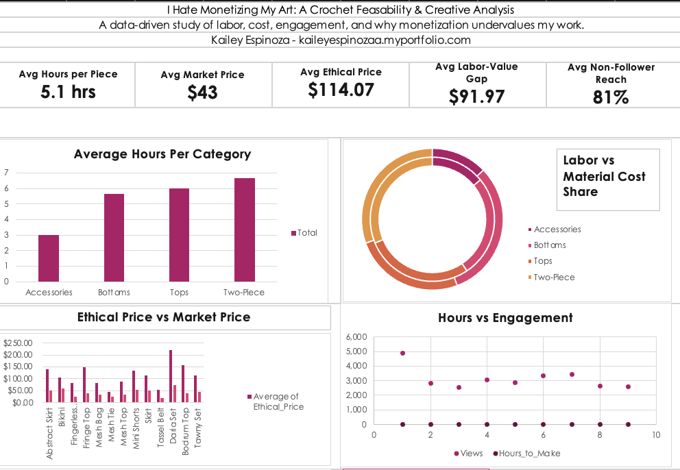
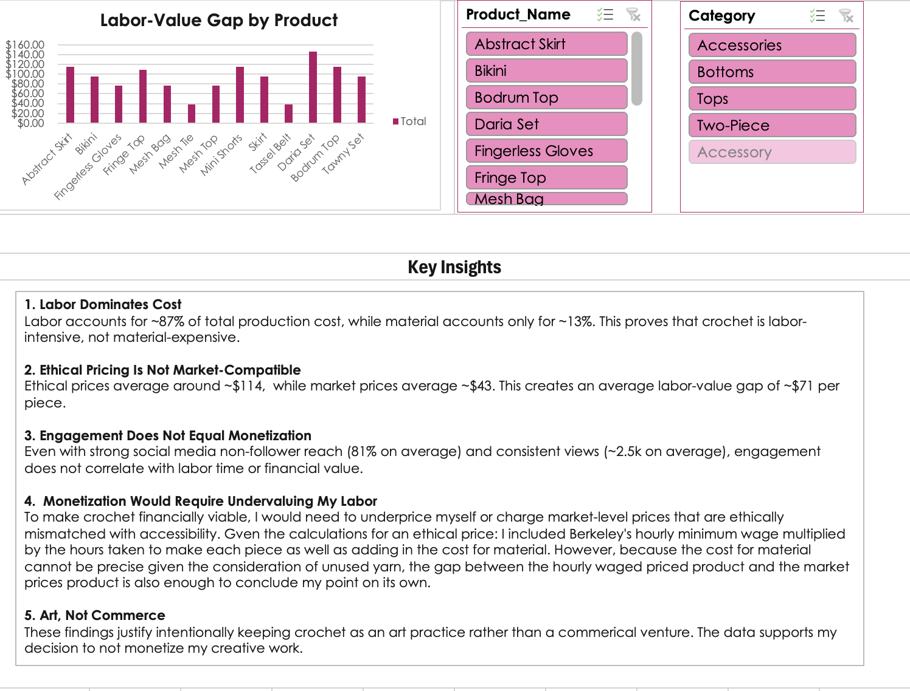

# I Hate Monetizing My Art: A Crochet Feasibility & Creative Analysis
This project examines the financial feasbility of crochet-based apparel a **non-mechanizable production process** using data visualization and exploratory analysis.
An interactive Excel Dashboard consolidates production, engagenment, and iteration variables into a single analytical view. 

## Dashboard Preview

## What the dashboard examines 
- Labor time and design complexity across garment categories
- Ethical price versus market price comparisons
- Labor-material cost shares
- Engagement patterns relative to production effort

## Repository Structure 
- `images/` - Dashboard screenshot for preview
- `excel/` — [Crochet_Analytics.xlsx](https://github.com/user-attachments/files/24303733/Crochet_Analytics.xlsx)
